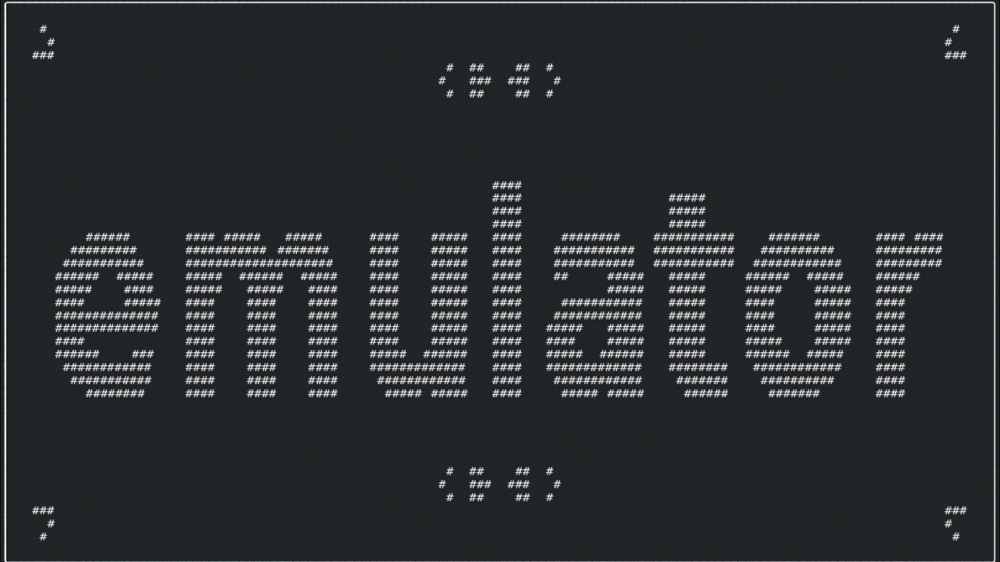
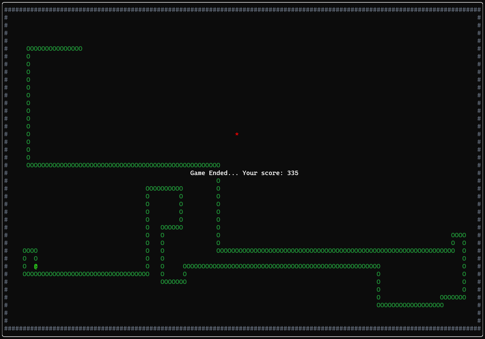

# Emulator

A small C++23 emulator and assembler for a custom CPU architecture.

This video was generated using Conway's Game of Life
written in assembly for this very emulator.


## Requirements
- Git
- Cmake
- C++23 compatible compiler

## Build
Clone the repository:
```
git clone https://github.com/KovarJoel/emulator.git
cd emulator
```

Configure and build:
```
cmake -S . -B ./build
cmake --build ./build --parallel
```

This produces the following executables:
- `emulator` - runs the interactive emulator with its TUI
- `assembler` - CLI tool for assembling a written program in the projects assembly language and generating a binary
- `tests` - runs the test suite

Note: The emulator and the test suite depend on
external libraries,
[FTXUI](https://github.com/ArthurSonzogni/FTXUI) and
[Catch2](https://github.com/catchorg/Catch2)
respectively, which are automatically
downloaded by cmake during the build process.

## Running
### Tests
After building, run the test suite to verify that everything
works as expected. If some tests fail it is an indication that
the assembler and emulator themselves will not properly work.
Testcases may fail because of e.g. a different endian-ness
or other platform problems.

```
./build/tests
```

### Assembler
Once all tests succeed, the assembler can be used to generate
binaries which can then be executed using the emulator.
```
./build/assembler <in:path-to-source> <out:path-to-binary>
```

### Emulator
After generating a binary, it can be run in the emulator as follows.
```
./build/emulator <in:path-to-binary>
```

## Examples
The [examples](./examples/) folder contains a few assembly
programs which can directly be assembled and run.

The most prominent of which is the [snake](./examples/snake.easm) game.
It makes use of the TUI to render a graphical window and
represents the entities using colored ascii symbols.
It also uses the memory mapped keyboard input to poll input
events and move the snake.



To run it execute the following commands:
```
mkdir ./binaries
./build/assembler ./examples/snake.easm ./binaries/snake
./build/emulator ./binaries/snake
```

## Documentation
For a more detailed documentation of the
architecture, instruction set, assembler,
memory layout, etc. have a look at the
[docs](./docs/).

## License
This project is released into the public domain
under the [Unlicense](./LICENSE) and is provided
"as is", without any warranty.

## Motivation
I wanted to build an emulator for quite some time
now, however without an extensive dive into
documentation which would be necessary to
emulate an existing CPU. Neither did I want to
build a large scale project without a clear finish
line in sight. Therefore the idea was to come up
with a custom architecture and build everything
from scratch on my own.

Another important thing for me was that the
project is actually somewhat useable, which means
that there has to be proper IO for the emulator.
With that in mind I wanted to build a UI and
some kind of input event system. My goto program
for a small usability test is implementing a little
game, in this case snake.

My goal with this project is to deepen my knowledge
of how a CPU works and get some hands-on experience
on how to build a working emulator and assembler
for the first time.
Luckily I have just taken a processor architecture
class which came in handy with designing the
instruction set architecture.
